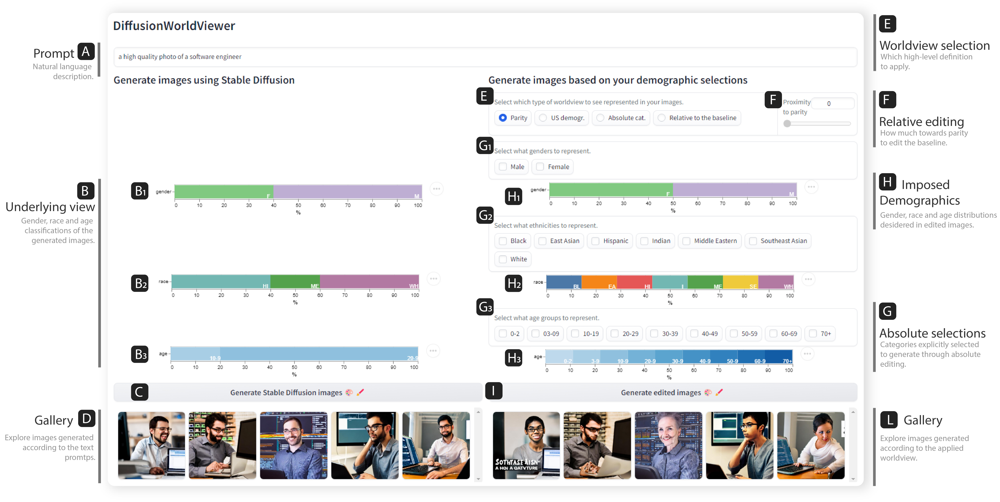

# DiffusionWorldViewer

This repository contains code for the paper:

[What is a Fair Diffusion Model? Designing Generative Text-To-Image Models to Incorporate Various Worldviews](https://arxiv.org/abs/2309.09944)
<br>
Authors: Zoe De Simone, Angie Boggust, Arvind Satyanarayan, Ashia Wilson
<br>




## DiffusionWorldViewer Demo

A demo of the DiffusionWorldViewer can be run in Google Colab, by running this 
[](https://colab.research.google.com/github/zoedesimone/DiffusionWorldViewer/blob/main/DiffusionWorldViewer_Paper.ipynb)

## Citation
If you find the Embedding Comparator useful in your work, please cite:

```bibtex
@misc{desimone2023fair,
      title={What is a Fair Diffusion Model? Designing Generative Text-To-Image Models to Incorporate Various Worldviews}, 
      author={Zoe De Simone and Angie Boggust and Arvind Satyanarayan and Ashia Wilson},
      year={2023},
      eprint={2309.09944},
      archivePrefix={arXiv},
      primaryClass={cs.LG}
}
```
